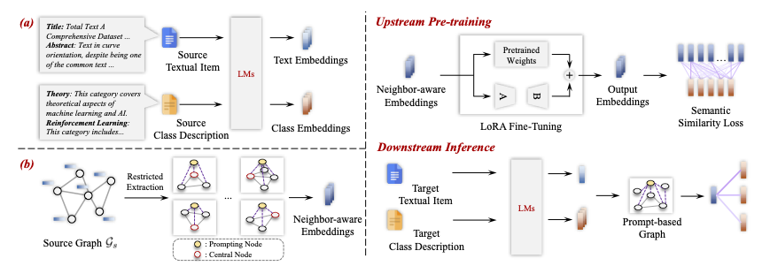

<h1 align="center"> ZeroG: Investigating Cross-dataset Zero-shot Transferability in Graphs </a></h2>
<h5 align="center"> If you like our project, please give us a star ⭐ on GitHub for the latest update.</h5>

<h5 align="center">

    

</h5>

This is the official implementation of the following paper: 
> **ZeroG: Investigating Cross-dataset Zero-shot Transferability in Graphs** [[Paper](https://arxiv.org/abs/2402.11235)]
> 
> Yuhan Li, Peisong Wang, Zhixun Li, Jeffrey Xu Yu, Jia Li


<p align="center"></p>
<p align="center"><em>The framework of ZeroG.</em></p>

# Environment Setup
Before you begin, ensure that you have Anaconda or Miniconda installed on your system. This guide assumes that you have a CUDA-enabled GPU.
After create your conda environment (we recommend python==3.10), please run 
```
pip install -r requirements.txt
```
to install python packages.


# Datasets
Datasets ```tech.pt``` and ```home.pt``` are availabel in this [link](https://drive.google.com/drive/folders/1kifRUaZ9JzcjByj47FeANfXEeEZd4sJk), while other datasets in ZeroG are available in this [link](https://drive.google.com/drive/folders/1WfBIPA3dMd8qQZ6QlQRg9MIFGMwnPdFj?usp=drive_link).
Please download and place them in folder ```datasets```.

# Run ZeroG
```
bash run.sh
```

<br> **📑 If you find our projects helpful to your research, please consider citing:** <br>
```
@article{li2024zerog,
  title={ZeroG: Investigating Cross-dataset Zero-shot Transferability in Graphs},
  author={Li, Yuhan and Wang, Peisong and Li, Zhixun and Yu, Jeffrey Xu and Li, Jia},
  journal={arXiv preprint arXiv:2402.11235},
  year={2024}
}
```

## FYI: our other works

<p align="center"><em>🔥 <strong>A Survey of Graph Meets Large Language Model: Progress and Future Directions (IJCAI'24) </strong></em></p>
<p align="center"><em><a href="https://github.com/yhLeeee/Awesome-LLMs-in-Graph-tasks">Github Repo</a> | <a href="https://arxiv.org/abs/2311.12399">Paper</a></em></p>
